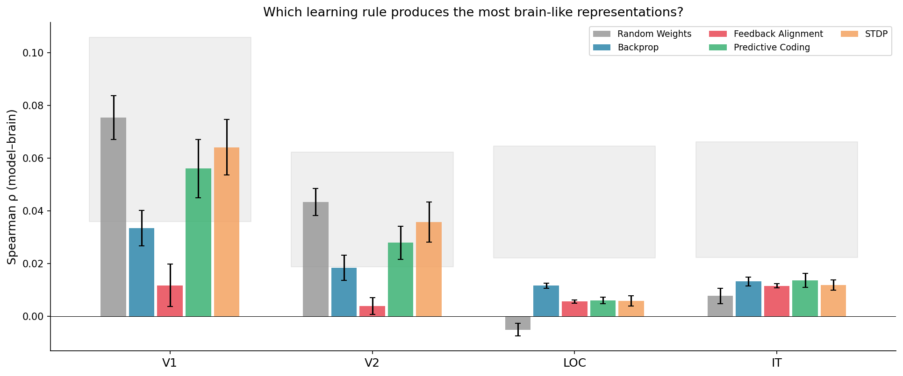

# Untrained CNNs Match Backpropagation at V1

> **A Systematic RSA Comparison of Four Learning Rules Against Human fMRI**  
> Companion repository for the paper, currently corresponding to **arXiv v2**.  
> For the repository state associated with the original submission, see [Release v1](https://github.com/nilsleut/learning-rules-rsa/releases/tag/v1).

[](https://arxiv.org/abs/2604.16875)
[](https://www.python.org/)
[](https://pytorch.org/)
[](LICENSE)

---

## Overview

A central question in computational neuroscience is whether the **learning rule** used to train a neural network determines how well its internal representations align with the human visual cortex. This repository presents a systematic comparison of five conditions:

| Condition | Training | Key mechanism |
|-----------|----------|---------------|
| **Random Weights** | None | Architectural baseline (He-normal init) |
| **Backpropagation (BP)** | Supervised | Global error signal, symmetric weights |
| **Feedback Alignment (FA)** | Supervised | Fixed random feedback matrices |
| **Predictive Coding (PC)** | Unsupervised (conv) + BP (FC) | Hierarchical prediction-error minimization |
| **STDP** | Unsupervised (conv) + BP (FC) | First-spike timing, local Hebbian updates |

All conditions use an **identical CNN architecture** trained on CIFAR-10 (8,000 samples, 40 epochs). For evaluation, 720 stimuli from the THINGS-fMRI dataset are passed through each network at 224×224 resolution. Layer-wise representational dissimilarity matrices (RDMs) are compared to human 7T fMRI RDMs from four visual cortex regions (V1, V2, LOC, IT) using Spearman rank correlation (RSA). All results are averaged across 5 random seeds.

---

## Main Result

The central finding is that **early visual alignment is architecture-driven, not learning-rule-driven**. At V1/V2, an untrained CNN exceeds all trained rules. Only at intermediate stages (LOC) does supervised training (BP) show a selective advantage. At the highest level (IT), all rules converge completely.



---

## Key Findings

- **Architecture dominates at V1/V2:** the untrained baseline exceeds BP by Δρ = +0.044 (p < 0.001). Convolutional inductive biases — local connectivity, ReLU, pooling — drive early visual alignment without any training.
- **STDP is the best-performing trained rule at V1** (ρ = 0.064), followed by PC (ρ = 0.056). Both use local updates without global error signals, preserving the architectural inductive bias.
- **BP moves early-layer representations away from V1-like structure.** Despite 82.4% task accuracy, BP produces lower V1 alignment than the untrained baseline.
- **Only BP reliably exceeds random at LOC** (ρ = 0.012 vs. −0.005, Δρ = +0.017, p < 0.001), indicating that supervised classification objectives drive intermediate-level visual representations.
- **All conditions converge at IT** (ρ = 0.008–0.014); no pairwise difference survives FDR correction, including Random vs. BP (p = 0.051).
- **FA consistently produces the lowest alignment** across V1, V2, and LOC — significantly below all other conditions at V1/V2 (p < 0.001) — despite achieving 39% task accuracy.
- **Task performance and brain alignment are dissociated throughout the hierarchy.** Accuracy order (BP: 82% > STDP: 63% > PC: 57% > FA: 39% > Random: 10%) does not predict RSA order at V1 or IT.
- **All effects survive partial RSA** controlling for pixel-level similarity. The ordering Random > STDP > PC > BP > FA at V1 is fully preserved after residualizing both model and brain RDMs against the pixel RDM.
- **Seed variability is small relative to between-rule differences** at V1/V2 (std ≈ 0.003–0.007 vs. Δρ ≈ 0.044), confirming that rankings are stable across initializations.

---

## Quantitative Results

RSA scores (Spearman ρ, mean across 5 seeds) with 95% bootstrap CIs. Significance vs. Random Weights (permutation test, N = 1,000, FDR-corrected BH). **Bold**: best condition per ROI.

| ROI | Layer | Random Weights | BP | FA | PC | STDP |
|-----|-------|:--------------:|:--:|:--:|:--:|:----:|
| V1  | Conv1 | **0.076** [.072, .080] | 0.034 [.029, .037]*** | 0.012 [.008, .016]*** | 0.056 [.052, .060]*** | 0.064 [.060, .068]*** |
| V2  | Conv1 | **0.043** [.040, .047] | 0.019 [.015, .023]*** | 0.004 [.000, .008]* | 0.028 [.024, .032]*** | 0.036 [.032, .040]* |
| LOC | Conv3 | −0.005 [−.009, −.001] | **0.012** [.008, .016]*** | 0.006 [.002, .009]*** | 0.006 [.002, .010]*** | 0.006 [.002, .009]*** |
| IT  | FC1   | 0.008 [.004, .012] | **0.013** [.009, .017]ns | 0.012 [.008, .015]ns | 0.014 [.010, .017]* | 0.012 [.008, .016]ns |

`*** p < 0.001  ** p < 0.01  * p < 0.05  ns p >= 0.05`

### Partial RSA at V1 (pixel similarity controlled)

| Condition | rho_std | rho_partial | Delta |
|-----------|---------|-------------|-------|
| Random    | 0.078   | 0.074       | −0.004 |
| STDP      | 0.067   | 0.061       | −0.005 |
| PC        | 0.058   | 0.054       | −0.004 |
| BP        | 0.034   | 0.026       | −0.008 |
| FA        | 0.012   | 0.005       | −0.007 |

### CIFAR-10 Task Performance

| Condition | Accuracy (%) |
|-----------|:------------:|
| Backpropagation | 82.4 |
| STDP | 63.2 |
| Predictive Coding | 56.6 |
| Feedback Alignment | 39.0 |
| Random Weights | 10.0 |

---

## Architecture & Methods

### Model Architecture

All five conditions share an identical CNN:

```
Input (224x224) → Conv1 [BN+ReLU+Pool] → Conv2 [BN+ReLU+Pool] → Conv3 [BN+ReLU+Pool] → FC1 (512) → FC2 (Softmax)
```

Layer-to-ROI mapping (standard ventral stream correspondence):

| Layer | ROI |
|-------|-----|
| Conv1 | V1  |
| Conv1 | V2  |
| Conv3 | LOC |
| FC1   | IT  |

Training: 8,000 CIFAR-10 samples, 40 epochs, 32×32 resolution.  
RSA evaluation: THINGS stimuli resized to 224×224 at feature extraction time.

### Learning Rules

- **Random Weights:** He-normal initialization, never trained. Isolates the contribution of convolutional architecture.
- **BP:** Standard gradient descent, ΔW_l = −η ∂L/∂W_l.
- **FA:** Replaces W_l^T in the backward pass with a fixed random matrix B_l (Lillicrap et al., 2016).
- **PC:** Hierarchical prediction-error minimization. Prediction errors ε_l = r_l − r̂_l drive both inference (T_inf = 10 steps, α = 0.02) and weight updates (ΔW_l ∝ ε_l x_{l−1}^T). Only Conv1–Conv3 updated via PC; FC layers trained with BP.
- **STDP:** Poisson spike trains (T = 10 timesteps), first-spike timing weight updates (τ+/− = 20 ms, A+/− = 0.003, lr = 5e-4). Only Conv1–Conv3 updated via STDP; FC layers trained with BP as a linear probe.

### RSA Pipeline

1. Extract activations on 720 THINGS stimuli (224×224); spatially average convolutional activations.
2. Compute model RDMs as 1 − r (correlation distance).
3. Compute brain RDMs from THINGS-fMRI 7T responses (3 subjects, 4 ROIs); average across subjects.
4. RSA score = Spearman ρ between upper triangles of model and mean-brain RDM.
5. Bootstrap CIs: N = 10,000 resamplings of stimulus pairs.
6. Noise ceiling: Spearman–Brown corrected split-half reliability.
7. Statistical tests: permutation tests (N = 1,000), BH FDR correction across 40 comparisons.
8. Partial RSA: residualize model and brain RDM vectors against a pixel RDM (flattened 224×224 RGB).

---

## Repository Structure

```
figures/          Final figures used in the manuscript (Figures 1–9)
│
paper/            LaTeX source, bibliography, and compiled PDF (arXiv v2)
│
programs/         All analysis code
│   ├── train.py                    Training loop for all learning rules
│   ├── extract_features.py         Activation extraction on THINGS stimuli
│   ├── compute_rdms.py             Model and brain RDM computation
│   ├── rsa_analysis.py             Main RSA scoring
│   ├── permutation_tests.py        Pairwise permutation tests + FDR correction
│   ├── partial_rsa.py              Pixel-similarity-controlled RSA
│   ├── best_layer_analysis.py      Best-layer-per-ROI sweep
│   ├── filter_analysis.py          Gabor-peakedness + filter visualization
│   └── plot_*.py                   Plotting scripts (one per figure)
│
results/          Pre-computed outputs
    ├── rdms/                        Saved model and brain RDMs
    ├── rsa_scores/                  RSA scores per condition, ROI, seed
    ├── permutation/                 Permutation test p-values
    └── summaries/                   Aggregated tables (CSV)
```

---

## Reproducing the Results

### Environment

```bash
git clone https://github.com/nilsleut/learning-rules-rsa.git
cd learning-rules-rsa
pip install -r requirements.txt
```

### Data

THINGS-fMRI is not redistributed here. Download it from the [original source](https://doi.org/10.1016/j.neuroimage.2022.119628) and place the pre-computed RDMs in `results/rdms/brain/`. All intermediate results in `results/` allow figure reproduction without re-running training.

### Training

```bash
python programs/train.py --rule bp     # 82.4% accuracy
python programs/train.py --rule fa     # 39.0% accuracy
python programs/train.py --rule pc     # 56.6% accuracy
python programs/train.py --rule stdp   # 63.2% accuracy
# Random Weights: no training required
```

Each run saves model checkpoints to `results/checkpoints/`. Results are averaged across 5 seeds by default (configurable via `--seeds`).

### Feature Extraction & RSA

```bash
python programs/extract_features.py   # Saves activations per layer/condition/seed
python programs/compute_rdms.py       # Builds model RDMs from activations
python programs/rsa_analysis.py       # Computes Spearman rho + bootstrap CIs
python programs/permutation_tests.py  # Pairwise permutation tests + FDR correction
python programs/partial_rsa.py        # Pixel-similarity-controlled RSA
```

### Figures

| Figure | Description | Script |
|--------|-------------|--------|
| Fig. 1 | Architecture diagram | TikZ in LaTeX source |
| Fig. 2 | Training loss & accuracy curves | `programs/plot_training_curves.py` |
| Fig. 3 | Brain alignment across ROIs (main result) | `programs/plot_rsa_comparison.py` |
| Fig. 4 | Hierarchical gradient per learning rule | `programs/plot_hierarchy.py` |
| Fig. 5 | Pairwise permutation test forest plot | `programs/plot_permutation_forest.py` |
| Fig. 6 | Subject-level RSA consistency | `programs/plot_subject_consistency.py` |
| Fig. 7 | Seed variability (mean ± std) | `programs/plot_seed_variability.py` |
| Fig. 8 | Partial RSA vs. standard RSA | `programs/plot_partial_rsa.py` |
| Fig. 9 | Conv1 filter analysis + Gabor-peakedness | `programs/plot_filters.py` |

---

## Versions

| Version | arXiv | Description |
|---------|-------|-------------|
| [v1](https://github.com/nilsleut/learning-rules-rsa/releases/tag/v1) | [2604.16875v1](https://arxiv.org/abs/2604.16875v1) | Initial submission (18 Apr 2026) |
| **v2** (current) | [2604.16875v2](https://arxiv.org/abs/2604.16875v2) | Final version (29 Apr 2026) |

---

## Citation

```bibtex
@article{leutenegger2026untrained,
  title   = {Untrained {CNN}s Match Backpropagation at {V1}: A Systematic {RSA}
             Comparison of Four Learning Rules Against Human {fMRI}},
  author  = {Leutenegger, Nils},
  journal = {arXiv preprint arXiv:2604.16875},
  year    = {2026},
  url     = {https://arxiv.org/abs/2604.16875}
}
```

---

## Acknowledgements

The author thanks Martin Schrimpf for the arXiv endorsement and helpful feedback, the creators of the THINGS-fMRI dataset for making their data publicly available, and the Brain-Score team for their evaluation infrastructure.

---

## License

This project is licensed under the [MIT License](LICENSE).

---

*Nils Leutenegger · 2026 · [github.com/nilsleut](https://github.com/nilsleut)*
